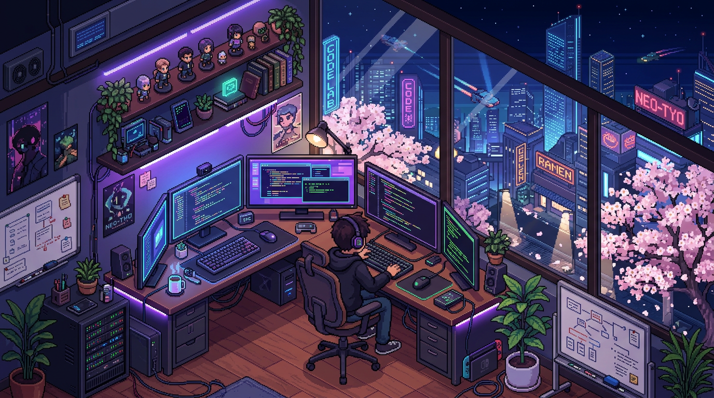

<p align="center">
  
</p>

<p align="center">
  <a href="https://readme-typing-svg.demolab.com">
    
  </a>
</p>

<p align="center">
  
  <a href="https://sohrab300.github.io/3D-portfolio/">
    
  </a>
</p>

<p align="center">
  
</p>


<h2 align="center">⚡ main/identity.ts ⚡</h2>

```typescript
/**
 * @profile Sohrab Sheikh
 * @location Jodhpur, Rajasthan 🇮🇳 (The Blue City)
 */
export const Sohrab = {
  role:     "Full-Stack Developer",
  mission:  "Architecting high-performance web ecosystems",
  focus:    ["Scalable Microservices", "Real-time Communication", "Developer Productivity"],
  motto:    "Ship fast. Refactor often. Never stop learning.",
  current:  "Exploring the intersection of Agentic AI and DevOps"
};
```


<h2 align="center">⚡ core/tech-stack.ts ⚡</h2>

<table align="center">
  <tr>
    <td align="center"><b>Frontend</b></td>
    <td align="center"><b>Backend</b></td>
    <td align="center"><b>Data & Infrastructure</b></td>
  </tr>
  <tr>
    <td align="center">
      
    </td>
    <td align="center">
      
    </td>
    <td align="center">
      
    </td>
  </tr>
</table>


<h2 align="center">⚡ services/observability.json ⚡</h2>

<div align="center">
  <table>
    <tr>
      <td align="center">
        
      </td>
      <td align="center">
        
      </td>
    </tr>
  </table>
</div>


<h2 align="center">⚡ scripts/contribution-graph.py ⚡</h2>

<p align="center">
  <picture>
    <source media="(prefers-color-scheme: dark)" srcset="https://raw.githubusercontent.com/Sohrab300/Sohrab300/output/github-snake-dark.svg">
    <source media="(prefers-color-scheme: light)" srcset="https://raw.githubusercontent.com/Sohrab300/Sohrab300/output/github-snake.svg">
    
  </picture>
</p>


<h2 align="center">⚡ logs/system-stats.log ⚡</h2>

```bash
[SYSTEM INFO]
User: sohrab@jodhpur
Interest: ⚡ Full-stack | 🧩 Optimization | 🌱 AI Agents

[PERSONAL FACTS]
- 🔨 Peak productivity happens after 12:00 AM.
- 🤝 Open for: High-impact collaborations & freelance projects.
- 📍 Based in Jodhpur, Rajasthan (Home of the Mehrangarh Fort).
```


<h2 align="center">⚡ config/philosophy.txt ⚡</h2>

<p align="center">
  <em><strong>"First, solve the problem. Then, write the code."</strong></em>
</p>


<h2 align="center">⚡ api/v1/contact.http ⚡</h2>

<p align="center">
  <a href="mailto:sheikhsohrab618@gmail.com">
    
  </a>
  <a href="https://www.linkedin.com/in/sohrab-sheikh-139166249/">
    
  </a>
  <a href="https://sohrab300.github.io/3D-portfolio/">
    
  </a>
</p>

<p align="center">
  
</p>
